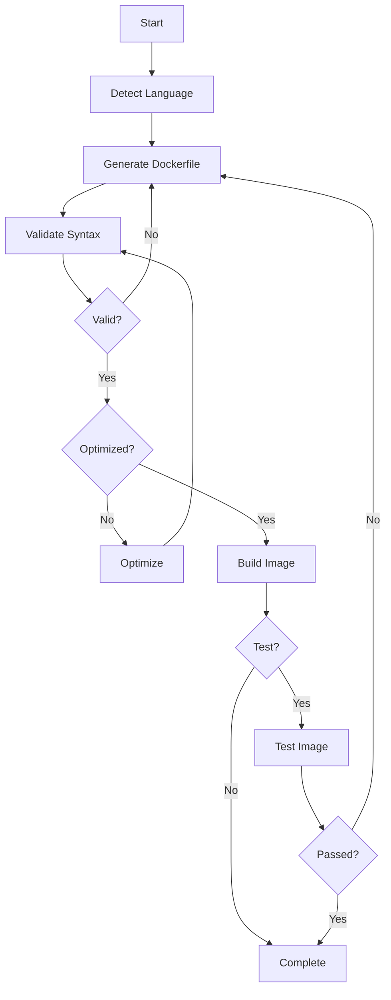

# Script Dockerizer 🐳🤖

An AI-powered tool that automatically generates production-ready Dockerfiles for scripts using LangGraph workflows and multiple LLM providers.

[](https://www.typescriptlang.org/)
[](https://www.docker.com/)
[](https://langchain-ai.github.io/langgraph/)

## 🚀 Quick Start

**Prerequisites**: Node.js 18+, Docker, and an LLM API key (OpenAI/Anthropic/Google)

```bash
# Install
git clone <repository-url> && cd Jit-ai-challenge
yarn install

# Configure
cp env.example .env
# Edit .env and add your API key for your chosen provider
# e.g., OPENAI_API_KEY=sk-... or ANTHROPIC_API_KEY=sk-ant-... or GOOGLE_API_KEY=...
# change DEFAULT_LLM_PROVIDER accordingly

# Run
yarn build
yarn start test/fixtures/line_counter.sh test/fixtures/README_line_counter.md

# Or in dev mode
yarn dev test/fixtures/word_reverser.py test/fixtures/README_word_reverser.md

# See all the options below
```

## 🎯 Features

- 🧠 **AI Language Detection**: Automatically detects any scripting language
- 🐳 **Smart Dockerfile Generation**: Production-ready with multi-stage builds and security best practices
- ✅ **Docker BuildKit Validation**: Syntax validation with `docker build --dry-run`
- 🔄 **LangGraph Workflow**: Conditional logic and automatic error recovery
- 🚀 **Multi-LLM Support**: OpenAI, Anthropic, Google with cost optimization (~$0.001-0.007/script)
- 🧪 **Automated Testing**: Validates generated images with provided examples (enabled by default)

## 🛠️ Usage

```bash
script-dockerizer <script-path> <readme-path> [options]

Options:
  -p, --provider <name>    LLM provider: openai|anthropic|google [default: openai]
  -k, --api-key <key>      API key (or set in .env)
  -s, --skip-test          Skip validation tests (tests run by default)
  -c, --cleanup            Remove Docker image after completion
  --temperature <num>      LLM temperature 0.0-1.0 [default: 0.0]
  --max-tokens <num>       Max tokens for response [default: 1500]

Examples:
  yarn dev script.py README.md
  yarn dev script.sh README.md --provider anthropic --cleanup
  yarn dev script.js README.md --skip-test
```

## 📄 README Format

Your script's README must include `## Usage` and `## Example` sections with code blocks showing how to run the script and expected output. See examples in `test/fixtures/README_*.md`.

## 🏗️ Architecture

### Workflow



### Core Components

- **ScriptAnalyzer**: Extracts usage patterns from README and reads script content
- **LangGraph Workflow**: Orchestrates AI-powered generation with conditional logic and error recovery
  - Language Detection → Dockerfile Generation → Syntax Validation → Optimization
- **DockerManager**: Handles Docker operations (build, validate, run, cleanup)
- **LLM Provider Factory**: Multi-provider support (OpenAI, Anthropic, Google) with cost optimization

### Project Structure

```
src/
├── core/          # ScriptAnalyzer, DockerManager
├── graphs/        # LangGraph workflow orchestration
├── nodes/         # Language detection, generation, validation, optimization
├── prompts/       # AI prompt templates
├── config/        # LLM provider factory
├── types/         # TypeScript interfaces
└── cli.ts         # Command-line interface

test/
├── core/          # Unit tests
├── nodes/         # Workflow node tests
├── integration/   # End-to-end tests
└── fixtures/      # Test scripts and READMEs
```

## 🧪 Testing

```bash
yarn test              # Run all tests
yarn test -- --watch   # Watch mode
```

Test suite includes unit tests, integration tests, and Docker validation with mock LLM to avoid API costs.

**Adding New LLM Providers**: Update `src/config/llm-providers.ts` factory and add type in `src/types/index.ts`.

## 🐛 Troubleshooting

**API Key Error**: Ensure `.env` contains valid API key for your chosen provider (e.g., `OPENAI_API_KEY=sk-...`, `ANTHROPIC_API_KEY=sk-ant-...`, or `GOOGLE_API_KEY=...` according to your `DEFAULT_LLM_PROVIDER`)

**Docker Build Failed**:

- Check Docker is running: `docker info`
- Verify disk space: `docker system df`

**README Format Error**: Ensure README has `## Usage` and `## Example` sections with code blocks.

**Debug Mode**: Set `NODE_ENV=development` and `LOG_LEVEL=debug` for detailed logging.

## 🤝 Contributing

1. Fork the repository
2. Create feature branch and make changes
3. Add tests and ensure `yarn test` passes
4. Submit a Pull Request
